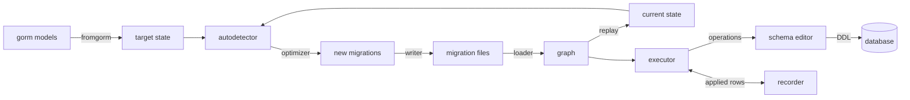

# Architecture

This page is for people who want to change gormgate, review it, or write a
backend for it. It describes how the pieces fit, and — more usefully — why
they are shaped the way they are.

## The constraint that shapes everything

gormgate is not inspired by Django's migrations; it is a port of them. Every
function names the Django function it comes from:

```go
// generateRenamedFields detects fields renamed within a model.
//
// django: autodetector.py MigrationAutodetector.generate_renamed_fields
func (a *Autodetector) generateRenamedFields() error {
```

Those `// django:` comments are load-bearing. They are how a reviewer checks
a change against the original, and they are why the algorithms are Django's
even where a Go author would have written something else. The shape *around*
the algorithms is Go: errors are returned rather than raised, state is
explicit, and a parser is built from a struct rather than from keyword
arguments.

Three things are frozen, and they explain most of the design:

1. **The decisions are Django 6.0's.** The same models must produce the
   same migrations, with the same operations, in the same order, and the
   same exit codes. A parity harness runs the same command sequences
   against a real Django project and compares what each of them did.
2. **The SQL is gorm's.** What gormgate emits for a set of models must equal
   what `gorm.AutoMigrate` emits for them, per database. That is what makes
   `migrate --fake-initial` safe.
3. **Generated migration files are a public format.** The field names of
   operation structs appear verbatim in files users commit, so renaming one
   is a breaking change.

## The pipeline



Read it as two halves that meet in the middle at **project state**.

`makemigrations` builds the state two ways and compares them. The *current*
state comes from replaying every existing migration's `StateForwards`; the
*target* state comes from the models. The difference is the new migration.
Nothing touches a database.

`migrate` takes the migrations, works out an order, and asks each operation
to apply itself through a schema editor.

## Project state is the source of truth

`migrations.ProjectState` holds `ModelState` values — a table name, its
fields, indexes, constraints and options. It is a plain data structure with
no database and no gorm in it.

That separation is why a migration means the same thing on every database
and why `sqlmigrate` can print SQL for a migration that has never run. It is
also why `RunGo` gets *historical* models: `ProjectState.Apps()` renders the
state into `Model` values that describe the schema **at that point in the
history**, not today's Go structs. A data migration written today still
works when it is replayed on a fresh database years from now, because it
sees the columns that existed when it ran.

`fromgorm` is the only place that knows about gorm's schema package. It
turns models into `ModelState`, reusing gorm's own `schema.Parse`,
`ParseIndexes`, `ParseCheckConstraints` and naming strategy — not a
reimplementation of them. The type of a column comes from the driver's
`Dialector.DataTypeOf`, which is what keeps guarantee 2 true.

## Migrations are compiled in

Go has no runtime import, so gormgate cannot discover migrations by scanning
a directory. A migration registers itself:

```go
func init() {
	m.Register(&m.Migration{App: "blog", Name: "0002_post_views", /* ... */})
}
```

and `makemigrations` maintains `cmd/gorm-gate/zz_gormgate_migrations.go`,
which blank-imports every migrations package. The next `go run` therefore
already has the new migration in the binary.

The failure mode this creates is a **stale binary**: a file on disk that is
not compiled in, or the reverse. The loader detects both and refuses to run
rather than migrating a history it cannot see.

## Graph, loader, executor

- **`graph`** holds migrations as nodes with dependency edges, and produces
  forwards and backwards plans. It knows about replacement (squashed
  migrations standing in for the ones they replace) and detects cycles.
- **`loader`** builds that graph from the registry, resolves `__first__` and
  `__latest__`, applies squash replacements, and checks the recorded history
  for inconsistency — a migration applied before its dependency.
- **`executor`** turns targets into a plan and runs it, deciding per
  migration whether to open a transaction (`Atomic` and whether the database
  can roll back DDL), recording the result, and handling `--fake` and
  `--fake-initial`.
- **`recorder`** is the `gormgate_migrations` table. It is written through
  the same schema editor as everything else, which is why it works on
  ClickHouse, where it needs a different column type.

## Backends

`backends/base` holds the algorithms every database shares — Django's
`BaseDatabaseSchemaEditor` — and a backend supplies only what differs.

There are two mechanisms, and the split is deliberate: a **Grammar** says
how this database spells a statement, and **Overrides** says which shared
steps it replaces.

`base.Grammar` is an interface of one method per statement kind, each
taking a struct of already-quoted parts:

```go
func (Grammar) AlterColumnType(c base.AlterColumnType) string {
	return "MODIFY " + c.Column + " " + c.Type + c.Collation + c.Comment
}
```

A backend embeds `base.BaseGrammar` and writes only the shapes it spells
differently — MySQL has fourteen, PostgreSQL three, TiDB none. A part the
caller has nothing for is an empty field rather than a missing map key, so
there is no rendering that can fail at run time, and a part a backend does
not use is simply ignored.

The second mechanism is an interface plus embedding. `base.Editor`
implements every step with a default; a backend embeds it and overrides the
steps its database needs. The base algorithms dispatch through `outer`, the
outermost `Overrides` value, so an override is reached even from inside a
shared algorithm:

```
base.AlterField ─→ outer.PerformAlterField ─→ sqlite3's table rebuild
base.CreateModel ─→ outer.TableSQL ─────────→ ClickHouse's ENGINE clause
```

It is the template-method pattern, which is what Django's inheritance was
doing. The indirection is load-bearing: `tidb.Editor` embeds `mysql.Editor`
embeds `base.Editor`, and a call that bypassed `outer` would silently get
MySQL's answer on TiDB.

`Overrides` declares 28 steps, and only the ones the shared algorithms
actually re-enter: a step a backend replaces but nothing here calls —
`AlterField`, which Oracle rewrites — is reached at the operation boundary
instead, through `migrations.SchemaEditor`. Each backend asserts
`var _ base.Overrides = (*Editor)(nil)`, so a method whose name does not
match a step is a build failure rather than a method nothing calls.

How much a backend replaces varies, and the spread is the point: SQL Server
replaces the most, GaussDB none at all — it reaches the same result through
its introspection queries, three feature flags and a check that refuses a
database in the wrong compatibility mode.

Two more things live here:

- **Features** — flags with Django's names (`CanRollbackDDL`,
  `SupportsPartialIndexes`, …) that record what the *server* does. A flag
  must be verified against a real server, not read from documentation, and a
  flag nobody reads is deleted, because it is a claim the code does not
  back.
- **Deferred SQL** — foreign keys and some indexes are collected and emitted
  after the tables exist, as Django does. A deferred `base.Statement` keeps
  its parts as live references and spells itself at the moment it runs, so
  a rename between the two is in the SQL that finally executes.

A connection is pinned (`base.Conn`): every statement of a command runs on
the same session, so session state like SQLite's `PRAGMA foreign_keys`
survives.

### Collect mode

`sqlmigrate` runs the whole migration with the editor in *collect* mode: the
statements are rendered and recorded instead of executed. That is why the
printed SQL is the real SQL, not a second implementation that could drift.

### Choosing a backend

A backend registers a `Detector` with the dialector it handles, a version
query and an optional check. `postgres` is claimed by both PostgreSQL and
CockroachDB, so detection is by priority and by what the server answers.
GaussDB's check refuses a database that is not in `DBCOMPATIBILITY 'PG'`,
because in the other modes the empty string is NULL and every `NOT NULL`
column would mean something different.

## The command line

`internal/management` holds the commands. The tree is
[cobra](https://github.com/spf13/cobra)'s: `Root` builds it, each command
binds its own flags with pflag and does its work in `RunE`, and a
`Context` carries what all of them need — the project, the streams, the
style and the verbosity.

The project is opened by the root's `PersistentPreRunE` rather than while
the tree is built, so `--help` works without a database and without a
settings file.

A command reports failure by returning an error, and the error's type
decides the exit status: `Error` is 1, `UsageError` is 2, `AbortError` is
3, and a `Silent` error keeps its own status while printing nothing,
because the command has already said what went wrong.

Flags bind straight to a struct of typed fields, so a command names its
options once:

```go
type migrateOptions struct {
	database    string
	appLabel    string
	fake        bool
	fakeInitial bool
	// ...
}

f.BoolVar(&o.fake, "fake", false, "record the migrations as applied without running them")
```

There is no options map in between, so a flag that no command reads, or a
field nothing fills, is visible in the code rather than at run time.

## Determinism

Everything that reaches a file or the terminal is ordered explicitly. Go
randomises map iteration, so every place that walks a map sorts its keys
first. This is not tidiness: `makemigrations` writes source files that go
into version control, and two runs over the same models must produce the
same bytes.

## How the guarantees are held

The test suites are part of the architecture, because they are what make the
three frozen properties true rather than aspirational.

| Suite | What it pins |
| --- | --- |
| Unit tests (`go test ./...`) | The ported algorithms, scenario by scenario from Django's own suites |
| **Conformance** (`itest`, per database) | Each operation applied forwards, compared against a schema built from scratch, unapplied, re-applied, its collected SQL replayed, and existing rows checked |
| **gorm parity** (`itest`, per database) | gormgate's schema equals `AutoMigrate`'s for the same models, and `AutoMigrate` over a gormgate schema wants exactly what it wants over its own |
| **Django parity** (`itest`, tag `parity`) | The same commands against a real Django 6.0 project in Docker: the same exit statuses, the same migrations written, the same operations planned |
| **Property** (`itest`, per database) | Random schema evolution: after each step `makemigrations` must report no changes, and `migrate zero` must leave only the recorder table |
| **End to end** (`itest`) | The example project driven through a real `go build`, with interactive input |

Ten databases are covered, each against a real server.

## Extending it

**A new database.** Write a `base.Grammar` for the statements it spells
differently, implement `base.Overrides` by embedding `*base.Editor`,
override what differs, implement `base.Introspection`, and register a
`Detector`. Start from `backends/tidb`, which only says how TiDB differs
from MySQL. A backend is not finished until conformance, gorm parity and
property evolution pass against a real server, its service is in
`itest/compose.yaml`, and its section is in
[Databases](vendors.md).

**A new operation.** Embed `migrations.BaseOperation` for the defaults and
implement what your operation does: `StateForwards` to change the state,
`DatabaseForwards`/`DatabaseBackwards` to change the database, `Describe`
for the output, and `Reduce` if the optimizer should be able to fold it into
a neighbour. The interface is sealed by an unexported method that
`BaseOperation` supplies, so operations can gain methods in a minor release
without breaking yours.

## Where the port stops

Some Django concepts have no GORM counterpart — managers, proxy models,
inheritance, swappable models, content types. They are not stubbed: they are
listed with their reasons in [Not applicable](not-applicable.md), and the system checks
reject a project that tries to use them.

Where gormgate deliberately decides differently from Django because gorm
models work differently, it is written down in
[Deviations](deviations.md). The parity harness enforces that nothing
outside that list differs.
